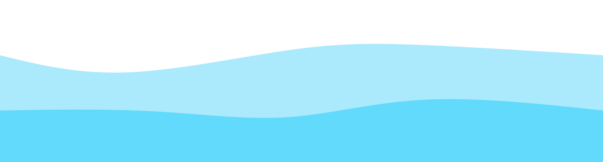

<h1 align="center" style="font-family:'Montserrat',sans-serif;font-weight:800;font-size:3rem;color:#2f74c0;">
  👋 Olá, Mundo! Eu sou o Vitor
</h1>

  

  💻 Desenvolvedor Back-end • 🔧 Criador de APIs • 🚀 Entusiasta de Desempenho

---

## 🧭 Um Pouco Sobre Mim

Sou **Vitor**, um desenvolvedor movido por **curiosidade, eficiência e propósito**.  
Minha missão é **transformar ideias em sistemas sólidos**, com foco em **alta performance** e **código limpo**.

> _“A melhor forma de prever o futuro é criá-lo.”_  
> — Peter Drucker

---

## ⚡ Stack Principal

  
  
  
  
  
  

---

## 🧠 Minha Filosofia

- 🧩 **Eficiência acima de tudo:** gosto de enxugar código até ele parecer óbvio.  
- 🤝 **Colaboração real:** tecnologia é sobre pessoas antes de ser sobre código.  
- 🔍 **Detalhismo técnico:** pequenos ajustes constroem grandes resultados.  
- 🧗‍♂️ **Desafios me movem:** cada bug é uma oportunidade de evolução.

---

## 🎯 Projetos & Aprendizado Contínuo

Eu acredito no **crescimento exponencial através da prática**.  
Por isso, estou sempre criando **APIs, sistemas e automações** para testar limites e explorar novas tecnologias.

---

## 🎮 Além do Código

Nos intervalos entre commits, gosto de:
- 🎨 Criar mini-jogos e experiências interativas  
- 📚 Estudar arquitetura de software e design de sistemas  
- ☕ Refletir sobre como tecnologia pode gerar impacto humano

---

## 🌍 Visão de Futuro

Quero usar a programação como **ferramenta de transformação social**.  
Meu objetivo é **ensinar jovens a programar** e mostrar que tecnologia é um **caminho possível e poderoso**.

---

## 📊 Estatísticas do GitHub

  
  
  

  

---

## 🌐 Conecte-se Comigo

  
  
  

---

  

  🌱 Sempre evoluindo — um commit de cada vez.

